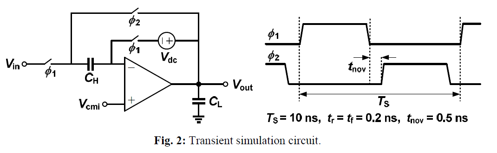

# Single-Stage-CMOS-Amplifier-and-Switched-capacitor-sample-hold-circuit
I designed the amplifier based on the given data then the results were not what we wanted so I changed the properties based on experience to acquire the desired results for more information you can read the report 
# Design the single-stage CMOS amplifier shown in Fig. 1 with the following specifications : 
* Open-loop DC gain >= 25 V/V
* Output voltage swing >= 0.5 Vpp
* CMRR >= 35 dB
* Settling time with 0.2% settling error in unity-gain sample & hold configuration =< 4 ns
* Load capacitance: CL = 1 pF
* Sample & hold capacitance: CH = 1 pF
* Input common-mode voltage: Vcmi = 0.3 V
* Output common-mode voltage: Vcmo = 0.5 V
* Ideal DC voltage: Vdc = 0.2 V
* Power supply voltage: VDD = 1.0 V
* Power dissipation: as low as possible
* Technology: 90 nm CMOS
Figure 2 shows a switched-capacitor sample & hold circuit which is used to evaluate the transient
performance of the amplifier. You are to design the amplifier to settle within 4 ns with a 0.2% settling
accuracy for both positive and negative input steps with a height of 0.25 V while driving a 1 pF load
capacitance. You can use ideal switches in switched-capacitor S/H circuit to realize the switches controlled
by different clock phases, but as a bonus you may also use actual MOS devices for the switches.
Document your results in a regular report including all of the simulation results. You are to report both
analytical design and simulation results in a Table and compare them together with sufficient explanations.

